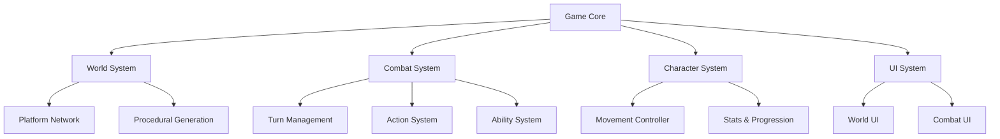

# Game Design Document

**Project:** Yasherica  
**Genre:** Action-Adventure / Tactical Combat  
**Version:** 1.0  
**Last Updated:** January 2026  
**Status:** 🟢 In Development

---

## Table of Contents

1. [Overview](#overview)
2. [Core Mechanics](#core-mechanics)
3. [Game Systems](#game-systems)
4. [Technical Architecture](#technical-architecture)
5. [Implementation Status](#implementation-status)

---

## Overview

### Game Concept

Yasherica is an action-adventure game featuring:
- **Procedurally generated platforming areas** with hex-based navigation
- **Turn-based tactical combat** with abilities and status effects
- **Platform-hopping exploration** with dynamic content
- **Modular architecture** supporting both local and networked gameplay

### Core Pillars

1. **Exploration** - Navigate through procedurally generated platform networks
2. **Combat** - Engage in turn-based tactical battles on hex grids
3. **Strategy** - Plan movement, manage abilities, and optimize positioning
4. **Replayability** - Procedural generation ensures unique experiences

---

## Core Mechanics

### 1. Platform Navigation

Players navigate through connected floating platforms in a 3D space.

```
Platform Network Structure:
┌─────────┐     ┌─────────┐     ┌─────────┐
│ Entry   │────→│ Combat  │────→│  Exit   │
│Platform │     │Platform │     │Platform │
└─────────┘     └─────────┘     └─────────┘
     │               │                │
     ↓               ↓                ↓
┌─────────┐     ┌─────────┐     ┌─────────┐
│ Treasure│     │  Shop   │     │  Boss   │
│Platform │     │Platform │     │Platform │
└─────────┘     └─────────┘     └─────────┘
```

**Platform Types:**
- **Simple** - Basic traversal platforms
- **Combat** - Initiates combat encounters
- **Treasure** - Contains loot and rewards
- **Shop** - Trading and upgrades
- **Boss** - Major combat challenges
- **Exit** - Level completion

**Navigation:**
- Click-to-move between connected platforms
- Each platform can have multiple neighbors
- Platform states: `Inactive`, `Active`, `Visited`, `Current`

### 2. Combat System

Turn-based tactical combat on hexagonal grids.

```
Combat Flow:
┌────────────────┐
│  Turn Start    │
│  - Reset units │
│  - Apply DOT   │
└───────┬────────┘
        ↓
┌────────────────┐
│ Player Actions │
│  - Move        │
│  - Abilities   │
│  - End turn    │
└───────┬────────┘
        ↓
┌────────────────┐
│   Validate     │
│   & Execute    │
└───────┬────────┘
        ↓
┌────────────────┐
│  Check Win     │
│  Conditions    │
└───────┬────────┘
        ↓
┌────────────────┐
│  Next Player   │
└────────────────┘
```

**Key Features:**
- **Hex-based positioning** for tactical gameplay
- **Ability queue system** - schedule, reorder, execute
- **Status effects** - Poison, Regeneration, Stun
- **Multiple win conditions** - Elimination, Objective, Survival, VIP
- **AI opponents** - Random or tactical decision-making
- **Network multiplayer** - Server-authoritative RPC-based

### 3. Character Progression

*[To be implemented]*

- Unit customization
- Ability unlocks
- Equipment system
- Stat progression

---

## Game Systems

### Detailed System Documentation

For in-depth documentation on specific systems, see:

1. **[World Design](WORLD_DESIGN.md)** - Platform system, area generation, procedural content
2. **[Combat Design](COMBAT_DESIGN.md)** - Turn-based combat, abilities, networking

### High-Level System Overview



### System Dependencies

- **Battlefield** → Used by Combat for hex positioning
- **Platform** → Used by World for navigation
- **Combat** → Triggered by Platform encounters
- **Character** → Shared between World and Combat

---

## Technical Architecture

### Architecture Principles

Following **Clean Architecture** with **MVP Pattern**:

```
┌─────────────────────────────────────────────────────────┐
│                   PRESENTATION LAYER                     │
│        (Unity MonoBehaviour, UI, Input, Views)          │
│  Depends on: Core, Combat, Platform                     │
└───────────────────────────┬─────────────────────────────┘
                            │
┌───────────────────────────┴─────────────────────────────┐
│                    APPLICATION LAYER                     │
│      (Controllers, Presenters, Use Cases)               │
│  Depends on: Core, Domain Logic                         │
└───────────────────────────┬─────────────────────────────┘
                            │
┌───────────────────────────┴─────────────────────────────┐
│                      DOMAIN LAYER                        │
│     (Pure C#, Business Rules, Game State)               │
│  No Unity Dependencies                                   │
└─────────────────────────────────────────────────────────┘
```

### Key Architectural Features

1. **Immutability** - GameState and core models are immutable
2. **Dependency Injection** - Zenject for all service bindings
3. **MVP Pattern** - Thin MonoBehaviour views, logic in presenters
4. **SOLID Principles** - Strictly enforced throughout
5. **Type Safety** - No dictionaries, all typed classes
6. **Testability** - Core logic testable without Unity

### Folder Structure

```
Scripts/
├── Core/                    # Project-wide core utilities
│   ├── DI/                  # Dependency injection installers
│   ├── Events/              # Global event system
│   └── Utils/               # Shared utilities
│
├── Battlefield/             # Hex grid system (shared)
│   ├── Core/                # Hex coordinates, grid logic
│   ├── Grid/                # Hex grid implementations
│   └── View/                # Hex visualization
│
├── Platform/                # Platform navigation system
│   ├── Model/               # Platform data models
│   ├── StateMachine/        # Platform state management
│   ├── Content/             # Platform content types
│   └── View/                # Platform visualization
│
├── LevelGeneration/         # Procedural area generation
│   ├── Area/                # Area generation logic
│   ├── Graph/               # Platform graph generation
│   ├── Scenario/            # Scenario definitions
│   └── Builder/             # Platform builders
│
├── Combat/                  # Turn-based combat system
│   ├── Core/                # Pure C# combat logic
│   ├── TurnManagement/      # Turn order and flow
│   ├── Execution/           # Action validation & execution
│   ├── Player/              # Human, AI, Network players
│   ├── View/                # Combat visualization
│   ├── Networking/          # Netcode integration
│   └── Integration/         # Combat-world integration
│
├── Character/               # Character movement and control
│   └── ...
│
└── UI/                      # User interface
    └── ...
```

---

## Implementation Status

### ✅ Fully Implemented

#### Combat System (100%)
- [x] Core combat logic (immutable, pure C#)
- [x] Turn management (round-robin)
- [x] Action system (6 action types)
- [x] Ability system with cooldowns
- [x] Status effects (Poison, Regen, Stun)
- [x] Damage and healing
- [x] Win conditions (4 types)
- [x] Human player input
- [x] AI players (Random + Tactical)
- [x] Combat UI and visualization
- [x] Network multiplayer (Netcode)
- [x] Zenject integration
- [x] Combat log and ability preview

**Documentation:** See [Combat/FULL_SYSTEM_COMPLETE.md](Combat/FULL_SYSTEM_COMPLETE.md)

#### Battlefield System (100%)
- [x] Hex coordinate system
- [x] Hex grid (flat-top and pointy-top)
- [x] Battlefield factory
- [x] Cell system
- [x] Battlefield visualization

#### Platform System (100%)
- [x] Platform interface and model
- [x] Platform state machine
- [x] Platform content system
- [x] Platform neighbors and connections
- [x] Platform visualization
- [x] Platform types (Simple, Combat, Treasure, etc.)

#### Level Generation (100%)
- [x] Procedural area generation
- [x] Platform graph generation
- [x] Scenario-based generation
- [x] Perlin noise for layout
- [x] Platform factories
- [x] Area visualization

---

### 🟡 Partially Implemented

#### Character System (60%)
- [x] Basic character movement controller
- [x] AI character movement
- [x] Dash mechanics
- [ ] Character stats and progression
- [ ] Inventory system
- [ ] Equipment system
- [ ] Character customization

#### UI System (40%)
- [x] Combat UI (turn info, unit stats)
- [x] Combat log
- [ ] World navigation UI
- [ ] Inventory UI
- [ ] Character sheet UI
- [ ] Main menu and settings
- [ ] HUD for exploration

---

### 🔴 Not Yet Implemented

#### Core Game Loop (0%)
- [ ] Scene transitions (World ↔ Combat)
- [ ] Save/Load system
- [ ] Game progression tracking
- [ ] Achievement system
- [ ] Tutorial system

#### Content Systems (0%)
- [ ] Item system
- [ ] Loot tables
- [ ] Enemy variety
- [ ] Boss encounters
- [ ] Treasure and rewards
- [ ] Shop system

#### Polish & UX (0%)
- [ ] Camera control system
- [ ] Audio system (SFX, music)
- [ ] Visual effects (particles, shaders)
- [ ] Animations
- [ ] Loading screens
- [ ] Performance optimization

#### Advanced Features (0%)
- [ ] Replay system
- [ ] Spectator mode
- [ ] Custom scenarios
- [ ] Level editor
- [ ] Modding support

---

## Development Roadmap

### Phase 1: Core Systems ✅ (COMPLETE)
- Combat system implementation
- Battlefield integration
- Platform navigation
- Procedural generation

### Phase 2: Content & Polish 🔄 (IN PROGRESS)
- Character progression
- Item system
- Enemy variety
- UI improvements
- Visual and audio polish

### Phase 3: Game Loop & Meta 📋 (PLANNED)
- Scene transitions
- Save/Load
- Progression tracking
- Tutorial
- Main menu

### Phase 4: Advanced Features 📋 (PLANNED)
- Replay system
- Advanced AI
- Network improvements
- Performance optimization
- Additional content

---

## Technical Requirements

### Unity Version
- Unity 2022.3 LTS or higher

### Required Packages
- **Zenject (Extenject)** - Dependency injection
- **TextMeshPro** - UI text rendering
- **Unity Input System** - Modern input handling
- **Netcode for GameObjects** - Network multiplayer

### Target Platforms
- Primary: PC (Windows, Mac, Linux)
- Secondary: Console (future consideration)

---

## Performance Targets

- **FPS:** 60 FPS minimum
- **Turn-based combat:** No real-time performance requirements
- **Area generation:** < 1 second for small areas
- **Network latency tolerance:** 100-500ms (turn-based)
- **Memory budget:** < 500MB for typical gameplay

---

## Version History

| Version | Date | Changes |
|---------|------|---------|
| 1.0 | Jan 2026 | Initial game design document created |

---

## Notes for Developers

### Adding New Features

1. **Read the architecture rules** in CLAUDE.md
2. **Follow SOLID principles** strictly
3. **Use Zenject** for dependency injection
4. **Keep MonoBehaviours thin** - logic in presenters
5. **Document changes** in relevant design docs

### Testing Guidelines

1. **Unit test** core logic (pure C# layers)
2. **Integration test** system interactions
3. **Manual test** UI and gameplay feel
4. **Profile** performance-critical paths

### Code Review Checklist

- [ ] Follows SOLID principles
- [ ] Uses MVP pattern correctly
- [ ] No Unity dependencies in Core
- [ ] Zenject bindings properly configured
- [ ] Interfaces over concrete types
- [ ] Immutability where appropriate
- [ ] No linter errors
- [ ] Documentation updated

---

**This is a living document. Update after significant changes.**

